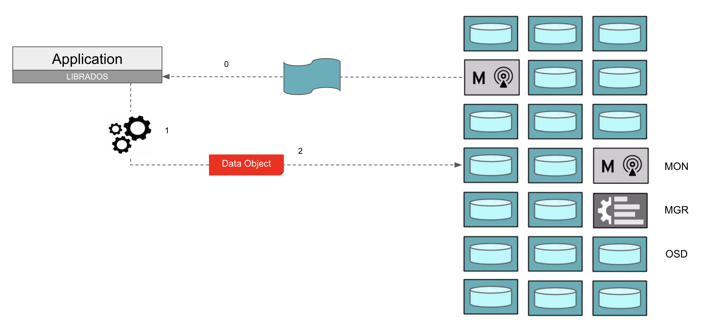
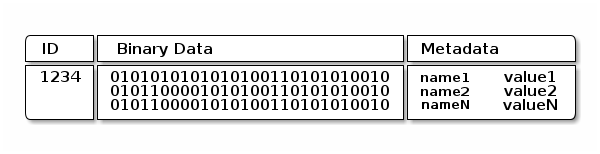
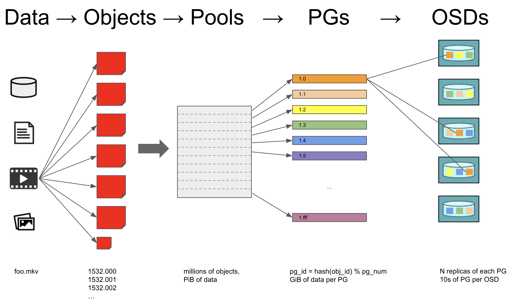

# 基本概念

## Ceph 架构

Ceph 架构如下图所示：

<figure class="screenshot">
    
</figure>

在底层 RADOS (Reliable, Autonomic Distributed Object Store) 存储服务的支撑下，Ceph 对外提供三种接口：

1. CephFS (Ceph File System): 文件系统接口，兼容 POSIX。
2. RGW (Rados Gateway): 对象存储接口，兼容 S3。
3. RBD (Raw Block Device): 块存储接口，提供虚拟块设备。

## Ceph 组件

Ceph 主要有以下组件：

* MON (Monitor): 保存 Ceph 存储集群的完整信息（称之为 cluster map），一般每个集群 3~7 个。
* MGR (Manager): 提供监控、编排、插件等功能，一般每个集群 2 个。
* OSD (Object Storage Device): 用于保存数据，一般每个集群 10~1000 个。
    * 每个 OSD 对应一个 HDD/SSD 存储设备。
    * 客户端直接向 OSD 发起 IO 请求。
    * OSD 之间互相合作，共同完成数据的可靠存储。
* MDS (Metadata Server): 用于在 CephFS 中存储所有文件的元数据，一般每个 CephFS 2 个。

<figure class="screenshot">
    
</figure>

客户端与 Ceph 通信的步骤如上图所示：

1. 客户端从 MON 获取 cluster map，包括 OSD 数量、地址等信息。
2. 客户端根据 cluster map 计算一个 object 应当存储在哪个 OSD。
3. 客户端向相应的 OSD 发起请求，写入 object。
4. 当集群发生变动时（例如存储设备损坏、节点增加），客户端从 MON 获取更新的 cluster map，重新计算 object 的存储位置，并与相应的 OSD 通信。
5. 当客户端通过 CephFS 接口访问 Ceph 时，文件元数据相关的操作（例如打开文件、创建文件夹）与 MDS 通信，文件数据相关的操作（例如写入文件、读取文件）与相应的 OSD 通信。

## RADOS 原理 

RADOS 存储数据以 object 为单位，每个 RADOS object 由 ID、二进制数据、元数据组成：

<figure class="screenshot">
    
</figure>

其中：

* ID 是每个 RADOS object 的全局唯一标识
* 二进制数据是 RADOS object 的主体，大小约数十 MB
* 元数据是一些键值对，数量可以有数万个，每个键值对的大小约数十 KB

下图展示了一个文件存入 RADOS 的具体原理：

<figure class="screenshot">
    
</figure>

当一个文件需要存入 RADOS 时，

1. 文件被分为很多个 RADOS object
2. RADOS object 被存入相应的 Pool
    * CephFS 分为 medata pool 和 data pool
    * RGW 分为 user pool、bucket pool、data pool 等
3. 一个 Pool 由很多个 PG (Placement Group) 组成
4. 每个 PG 默认会有 3 份拷贝，存储在不同的 OSD 中，确保少量 OSD 的损坏不会影响数据的完整性

根据数据可靠性要求的不同，我们可以：

* 配置 PG 的拷贝存储在不同的 OSD 中、不同的节点中、或者不同的机架中。
* 配置 PG 拷贝多份，或者配置 PG 以 [Erasure Code](./installation#配置-erasure-code) 的形式存储。
