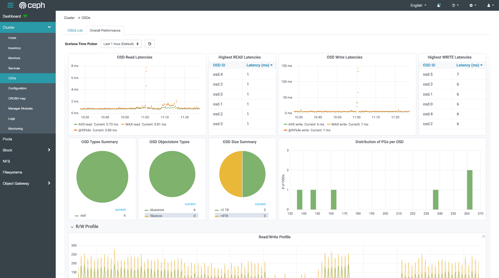

# 集群运维


## 查看集群状态

Ceph 提供了完善的 Web UI 来查看和操作集群中的各项服务。首先，使用管理员的用户名和密码登录 Ceph Web UI。


<figure class="screenshot">
    
</figure>


点击左侧导航栏的 Dashboard，查看集群状态总览。


<figure class="screenshot">
    
</figure>


点击左侧导航栏的 Cluster > OSDs，查看各个磁盘的使用情况。


<figure class="screenshot">
    
</figure>


点击左侧导航栏的 Cluster > OSDs，然后点击上侧的 Overall Performance，查看磁盘使用情况的可视化统计数据。


<figure class="screenshot">
    
</figure>


点击左侧导航栏的 Cluster > Logs，查看集群日志。


<figure class="screenshot">
    
</figure>


另外，您也可以通过 SSH 登录 Ceph 集群的**管理节点**，使用命令行来查看。

!!! info "什么是管理节点"

    添加了 _admin 标签的节点是管理节点，拥有管理整个集群的权限。通过以下命令将一个节点设为管理节点：


    ```
    sudo ceph orch host add <host-name> <host-ip> --labels _admin
    ```


查看集群状态总览：


```
sudo ceph status
sudo ceph -s
sudo ceph health detail
```


查看**本节点**上运行的各项服务状态：


```
sudo systemctl status ceph\*.service ceph\*.target
```


查看**本节点**上运行的某项服务的详细日志：


```
sudo journalctl -u <service-name>
```


例如：


```
sudo journalctl -u ceph-osd@0.service
```

参考文档：

* [Ceph - Operating a Cluster](https://docs.ceph.com/en/quincy/rados/operations/operating/)

## 管理 alert

在 Ceph Dashboard 中，点击左侧导航栏的 Cluster > Monitoring，可以查看当前集群中的警告信息。


<figure class="screenshot">
    
</figure>


如果确认警告信息无关紧要，您可以静默警告信息。首先在表格中点击所要静默的行，然后点击左上角的 Create Silence 按钮，填写静默时长和筛选条件等配置即可。

<figure class="screenshot">
    
</figure>


另外，您也可以通过命令行来静默警告信息。例如，如果通过命令行查看集群状态发现有如下警告：


```
$ ceph health detail
[WRN] MDS_SLOW_METADATA_IO: 1 MDSs report slow metadata IOs
```


您可以通过以下命令静默该警告：


```
ceph health mute MDS_SLOW_METADATA_IO
```


或在一定时间内静默警告：


```
ceph health mute MDS_SLOW_METADATA_IO 1h
```


通过以下命令取消静默：


```
ceph health unmute MDS_SLOW_METADATA_IO
```


参考文档：

* [Ceph - Muting Health Checks](https://docs.ceph.com/en/latest/rados/operations/monitoring/#muting-health-checks)


## 查看 daemon 状态

通过以下命令查看集群中运行的所有 daemon：


```
sudo ceph orch ls

sudo ceph orch ps 

sudo ceph orch ls --export > cluster.yaml
```

参考文档：

* [Ceph - Service Management](https://docs.ceph.com/en/quincy/cephadm/services/index.html)


## 获取 daemon 地址

为了获取某个 daemon 的地址，例如 prometheus、grafana、alert manager 等，首先通过以下命令查看 daemon 所在的节点与端口：

```
$ sudo ceph orch ps
NAME                           HOST   PORTS        STATUS        REFRESHED  AGE  MEM USE  MEM LIM  VERSION  IMAGE ID      CONTAINER ID
alertmanager.host1             host1  *:9093,9094  running (5w)     4m ago   8w    54.3M        -           ba2b418f427c  10679fbf3b3d
grafana.host1                  host1  *:3000       running (5w)     4m ago   8w     149M        -  8.3.5    dad864ee21e9  526bb2c28317
prometheus.host1               host1  *:9095       running (5w)     4m ago   8w     213M        -           514e6a882f6e  8579c7c74cc5
```

可以看到，prometheus、grafana、alert manager 均运行在 host1 节点上，并分别使用 9095、3000、9093 端口。

通过以下命令查看 host1 节点的 ip：

```
$ sudo ​​ceph orch host ls
HOST    ADDR          LABELS  STATUS
host1   10.1.2.3      _admin
```

因此：

* prometheus 的地址为 `http://10.1.2.3:9095`
* grafana 的地址为 `http://10.1.2.3:3000`
* alert manager 的地址为 `http://10.1.2.3:9093`


## 调整 daemon 配置

Ceph 支持以 yaml 配置文件的形式指定 daemon 的详细 spec。

以 rgw daemon 为例，导出配置文件：


```
sudo ceph orch ls --service_type rgw --export > rgw.yaml
```


rgw.yaml 示例如下：


```
service_type: rgw
service_id: cephs3
service_name: rgw.cephs3
placement:
  hosts:
  - host1
```


修改 rgw.yaml 为以下内容：


```
service_type: rgw
service_id: cephs3
service_name: rgw.cephs3
placement:
  count: 2
  hosts:
  - host1
  - host2
networks:
- 172.0.0.0/24
spec:
  rgw_frontend_port: 8081
```


其中：


* 配置 rgw daemon 为 2 个，host1 节点、host2 节点各一个
* 配置 rgw daemon 使用 172.0.0.0/24 网络
* 配置 rgw daemon 使用 8081 端口

应用该配置文件：


```
sudo ceph orch apply -i ./rgw.yaml
```


## 移除 daemon

通过以下命令移除某个 daemon：


```
sudo ceph orch daemon rm <daemon-name>
```


例如：


```
sudo ceph orch daemon rm mgr.ds03.obymbg
```


## 移除 service

通过以下命令移除某个 service：


```
sudo ceph orch rm <service-name>
```


例如：


```
sudo ceph orch rm mds.k8s
```


参考文档：

* [Ceph - Removing a Service](https://docs.ceph.com/en/quincy/cephadm/services/#removing-a-service)


## 查看 mon ip

通过以下命令查看 mon ip：


```
sudo ceph mon dump
```


## 创建 mon

默认情况下，Ceph 集群自动管理 mon daemon，一般在 5 个不同的节点上部署 5 个 daemon，占用节点的 3300 和 6789 端口。

如果需要手动管理 mon，首先执行以下命令：


```
sudo ceph orch apply mon --unmanaged
```


然后手动创建 mon：


```
sudo ceph orch daemon add mon --placement="myhost:[v2:1.2.3.4:3300,v1:1.2.3.4:6789]=name"
```


其中，`[v2:1.2.3.4:3300,v1:1.2.3.4:6789]` 是 mon 的网络地址，`=name` 用于指定所创建的 mon 名称。

参考文档：

* [Ceph - MON Service](https://docs.ceph.com/en/quincy/cephadm/services/mon/)
* [Ceph - Explicit Placements](https://docs.ceph.com/en/quincy/cephadm/services/index.html#explicit-placements)


## 查看 crash 历史

通过以下命令查看集群中曾经发生过的 crash 事件：


```
sudo ceph crash ls
```


查看某个 crash 事件的详细信息：


```
sudo ceph crash info <crash-id>
```


将 crash 事件归档，以免出现在 ceph status 的输出中：


```
sudo ceph crash archive-all
```

参考文档：

* [Ceph - Crash Module](https://docs.ceph.com/en/quincy/mgr/crash/)


## 查看节点

通过以下命令查看集群中的所有节点：


```
sudo ceph orch host ls
```


## 添加节点

见[集群安装 - 添加节点](./installation.md#添加节点)。


## 重启节点

通过 SSH 登录 Ceph 集群的任意一个节点，可执行以下命令重启**本节点**上的 Ceph 服务：


```
sudo systemctl stop ceph\*.service ceph\*.target
sudo systemctl start ceph.target 
```


## 移除节点

假设将被移除的节点名称为 host1，以下命令均需要在 Ceph 集群的**其他管理节点**上运行。

运行以下命令移除 host1：


```
sudo ceph orch host ls   
sudo ceph orch host drain host1
sudo ceph mon remove host1
```


观察 OSD 的移除情况，直到其报告 “No OSD remove/replace operations reported”：


```
sudo ceph orch osd rm status
```


观察 Daemon 的移除情况（这可能会需要较长的时间），直到其报告 “No daemons reported”：


```
sudo ceph orch ps host1
```


所有 Daemon 都被移除后才能通过以下命令删除节点 host1：


```
sudo ceph orch host rm host1
sudo ceph orch host ls
```


参考文档：


* [Ceph - Removing Hosts](https://docs.ceph.com/en/quincy/cephadm/host-management/#removing-hosts) 


## 查看存储设备

查看节点上的所有存储设备：


```
lsblk
```


查看集群中 Ceph 能看到的所有存储设备：


```
sudo ceph orch device ls
```


查看集群中运行的所有 OSD：


```
sudo ceph osd status
```


## 添加存储设备

见[集群安装 - 添加存储设备](./installation.md#添加存储设备)。


## 检查存储设备

如果某个存储设备出现异常，读写速度较慢，可通过以下命令检查：


```
hdparm -Tt <device-path>
```


例如：


```
hdparm -Tt /dev/sdb
```


## 移除存储设备

假设将被移除的磁盘上运行的 OSD 编号为 0（可通过 Web UI 或 sudo ceph osd status 命令获取）。

在磁盘所属节点上运行以下命令移除 OSD，并自动化地将该磁盘中存储的数据移动到其他磁盘中：


```
sudo ceph orch osd rm 0
```


通过以下命令查看 OSD 移除进展：


```
sudo ceph orch osd rm status
```


参考文档：


* [Ceph - Remove an OSD](https://docs.ceph.com/en/quincy/cephadm/services/osd/#remove-an-osd) 


## 存储设备故障恢复

如果某个存储设备发生故障，其中的数据无法读取，该存储设备对应的 OSD Daemon 在一段时间后会自动发现故障并显示在集群状态总览中。此时，管理员应当按照[移除存储设备](#移除存储设备)一节中的步骤移除故障设备，并将其从物理机器中拔出。

由于 Ceph 使用了冗余存储机制，一个存储设备的损坏并不会造成数据的丢失，Ceph 将自动恢复损坏的数据。一个 Ceph 集群具体能够容忍的存储设备损坏数量根据配置的不同有所区别，详见 [Erasure Code](./installation.md#配置-erasure-code) 一节。


## 查看存储空间

通过以下命令查看存储空间的整体使用情况：


```
sudo ceph df
```


通过以下命令查看每个 osd 的存储空间使用情况：


```
sudo ceph osd df
```


## 重启 mgr

mgr 负责集群的外围监控和管理，dashboard 即为 mgr 的一个组件。如果 dashboard 无法访问，可以尝试重启 mgr。

通过以下命令将当前正在运行的 mgr daemon 标记为失败，ceph 会自动重启该 daemon 并启用候补 daemon：


```
sudo ceph mgr fail
```


## 配置 crushmap

crushmap 用于指定数据如何存放到存储设备中，例如仅使用 hdd、仅使用 ssd、以 replicate 的形式、以 erasure code 的形式。

首先导出  crushmap：


```
sudo ceph osd getcrushmap -o comp_crush_map.cm
crushtool -d comp_crush_map.cm -o crush_map.cm
```


查看 crushmap：


```
$ cat crush_map.cm

...
# rules
rule replicated_hdd {
	id 0
	type replicated
	step take default class hdd
	step chooseleaf firstn 0 type osd
	step emit
}
rule replicated_ssd {
	id 1
	type replicated
	step take default class ssd
	step chooseleaf firstn 0 type osd
	step emit
}
rule ecpool-k4-m2 {
	id 2
	type erasure
	step set_chooseleaf_tries 5
	step set_choose_tries 100
	step take default class ssd
	step choose indep 0 type osd
	step emit
}
```


从上述 crushmap 示例可以看出：


* `type replicated` 表示 crush rule 是 replicate 类型
* `type erasure` 表示 crush rule 是 erasure code 类型
* `step take default class hdd` 表示 crush rule 仅使用 hdd
* `step take default class ssd` 表示 crush rule 仅使用 ssd
* `step chooseleaf firstn 0 type osd` 表示 crush rule 在不同的 osd 中存储数据的多个备份

您可以编辑并通过以下命令应用 crushmap：


```
crushtool -c crush_map.cm -o new_crush_map.cm
sudo ceph osd setcrushmap -i new_crush_map.cm
```


然后即可配置 pool 使用新的 crush rule，参考[配置 pool](#配置-pool)。

参考文档：

* [Ceph - CRUSH Maps](https://docs.ceph.com/en/quincy/rados/operations/crush-map/)
* [Ceph - Manaully editing a CRUSH map](https://docs.ceph.com/en/latest/rados/operations/crush-map-edits/)


## 查看 pool

通过以下命令查看集群中所有的 pool


```
sudo ceph osd lspools
```


## 删除 pool

通过以下命令删除一个 pool：


```
sudo ceph osd pool rm <pool-name> <pool-name> --yes-i-really-really-mean-it
```


注意：pool 中的数据将被彻底删除，无法恢复，请小心操作。


## 配置 pool

如果 pool 的 crush rule 是 replicate 类型，可通过以下命令设置 replicate size：


```
sudo ceph osd pool set <pool-name> size <size> --yes-i-really-mean-it
sudo ceph osd pool set <pool-name> min_size <min-size>
```


一般情况下，replicate pool 的 size 为 3（表示数据会被复制 3 份），min_size 为 2（表示最少有 2 份数据才能正常工作）。

特殊情况下，例如底层存储已经有 RAID 容错机制，可将 size 和 min_size 都设为 1。

如果集群中有多个 crush rule，可通过以下命令为 pool 指定 crush rule：


```
sudo ceph osd pool set <pool-name> crush_rule <crush-rule-name>
```

参考文档：

* [Ceph - Pools](https://docs.ceph.com/en/latest/rados/operations/pools/)


## 查看 cephfs

通过以下命令查看集群中所有的 cephfs：


```
sudo ceph fs ls
```


## 删除 cephfs

为了删除一个 cephfs，首先将其标记为不可用：


```
sudo ceph fs fail <fs-name>
```


然后确认删除该 cephfs：


```
sudo ceph fs rm <fs-name> --yes-i-really-mean-it
```


参考[删除 pool](#删除-pool)，删除该 cephfs 下属所有的 pool。

参考[移除 daemon](#移除-daemon)，移除该 cephfs 对应的所有 mds daemon。


## 挂载 cephfs

您可以通过 mount 命令在任意能够访问 Ceph 集群的机器上挂载 cephfs。

首先安装 ceph 工具：


```
curl --silent --remote-name --location https://github.com/ceph/ceph/raw/quincy/src/cephadm/cephadm
chmod +x cephadm
sudo ./cephadm add-repo --release quincy
sudo ./cephadm install ceph-common
```


然后配置访问权限：


```
mkdir -p -m 755 /etc/ceph
ssh root@<ceph-admin-node-ip> "sudo ceph config generate-minimal-conf" | sudo tee /etc/ceph/ceph.conf
chmod 644 /etc/ceph/ceph.conf

ssh root@<ceph-admin-node-ip> "sudo ceph fs authorize <fs-name> client.foo / rw" | sudo tee /etc/ceph/ceph.client.foo.keyring
chmod 600 /etc/ceph/ceph.client.foo.keyring
```


最后执行 mount 命令：


```
mount -t ceph foo@<cluster-id>.<fs-name>=/ <mount-path> -o secret=<client-keyring>
```


例如：


```
mount -t ceph foo@f5e95c18-a869-11ed-ba9b-b95348587a43.k8s=/ /mnt/mycephfs -o secret=AQBFgglkj0N0CRAA0LHXD/QFerke3mZZ6W3UAw==
```


注意：不要直接在 Ceph 集群的节点上挂载 cephfs，这可能会造成死锁。但在容器中挂载 cephfs 是可以的。

参考文档：


* [Ceph - Mount Using Kernel Driver](https://docs.ceph.com/en/quincy/cephfs/mount-using-kernel-driver/) 
* [Ceph - Do not mount on the same node](https://docs.ceph.com/en/quincy/rados/troubleshooting/troubleshooting-pg/#one-node-cluster) 


## 配置 cephfs

cephfs 支持的最大文件大小默认是 1TiB，可通过以下命令修改：


```
sudo ceph fs set <fs-name> max_file_size <num-bytes>
```


例如，修改为 4TiB：


```
sudo ceph fs set <fs-name> max_file_size 4398046511104
```


## 查看 osd

通过以下命令查看集群中所有的 osd 和 pool：


```
sudo ceph osd dump
```


## 查看 pg

查看所有 pg 情况：

```
sudo ceph pg dump
```


查看某个 pool 中的所有 pg：


```
sudo ceph pg ls-by-pool <pool-name>
```


查看某个 osd 中的所有 pg


```
sudo ceph pg ls-by-osd <pool-name>
```


查看存在异常的所有 pg：


```
sudo ceph pg dump_stuck unclean
```


查看某个 pg 的详细情况：


```
sudo ceph pg <pg-id> query
```

参考文档：

* [Ceph - Placement Groups](https://docs.ceph.com/en/latest/rados/operations/placement-groups/)
* [Ceph - Monitoring OSDs and PGs](https://docs.ceph.com/en/latest/rados/operations/monitoring-osd-pg/)


## 调整 pg 数量

一般情况下，建议通过以下命令禁用 pg autoscaling，以便集群正常运行：

```
sudo ceph config set osd osd_pool_default_pg_autoscale_mode off
```

禁用 pg autoscaling 后，通过以下命令设置每个 pool 的 pg 数量：

```
sudo ceph osd pool set <pool-name> pg_num <num>
sudo ceph osd pool set <pool-name> pgp_num <num>
```

例如：

```
sudo ceph osd pool set default.rgw.buckets.data pg_num 256
sudo ceph osd pool set default.rgw.buckets.data pgp_num 256
```


根据 [Red Hat 文档](https://access.redhat.com/documentation/zh-cn/red_hat_ceph_storage/3/html/storage_strategies_guide/placement_groups_pgs#pg_count)，推荐每个 osd 约 100~200 个 pg。


## 修复 pg

当集群的存储策略发生变化时，数据在重新平衡的过程中，pg 可能卡住，可尝试以下方式修复 pg：


```
sudo ceph pg force-backfill <pg-id>

sudo ceph pg force-recovery <pg-id>

sudo ceph pg repeer <pg-id>
```

## 手动 scrub / deep scrub

scrub 是指 Ceph 对 pg 中的数据进行一致性验证，通常每天进行一次。

deep scrub 是一种更深层次的 scrub，会读取数据的每个 bit 并计算 checksum，通常每周进行一次。


对某个 pg 进行 scrub / deep scrub：

```
sudo ceph pg scrub <pg-id>
sudo ceph pg deep-scrub <pg-id>
```


对某个 osd 上的所有 pg 进行 scrub / deep scrub：

```
sudo ceph osd scrub <osd-id>
sudo ceph osd deep-scrub <osd-id>
```


对某个 pool 中的所有 pg 进行 scrub / deep scrub：

```
sudo ceph osd pool scrub <pool-name>
sudo ceph osd pool deep-scrub <pool-name>
```


参考文档：

* [Ceph - Scrub a PG](https://docs.ceph.com/en/latest/rados/operations/placement-groups/#scrub-a-pg)


## 修改集群配置

Ceph 集群有非常多的配置可以实时修改。

查看某项配置的命令格式如下：


```
sudo ceph config get <who> <config-key>
```


修改某项配置的命令格式如下：


```
sudo ceph config set <who> <config-key> <config-value>
```


其中，`<who>` 表示该项配置对应的服务，如 mon、osd 等。

例如，获取 osd 中最多能够同时进行多少个 backfill 操作：


```
sudo ceph config get osd osd_max_backfills
```


设置该项配置的值为 8：


```
sudo ceph config set osd osd_max_backfills 8
```

参考文档：

* [Ceph - Configuring Ceph](https://docs.ceph.com/en/latest/rados/configuration/ceph-conf/)


## 调整数据平衡速度

当集群的存储策略发生变化时，数据会在 osd 之间进行重新平衡。如果期望尽快完成数据平衡，可以调整以下设置：


<table>
  <tr>
   <td>Name
   </td>
   <td>Default
   </td>
   <td>Now
   </td>
  </tr>
  <tr>
   <td>osd_max_backfills
   </td>
   <td>1
   </td>
   <td>8
   </td>
  </tr>
  <tr>
   <td>osd_recovery_max_active_hdd
   </td>
   <td>3
   </td>
   <td>8
   </td>
  </tr>
  <tr>
   <td>osd_recovery_priority
   </td>
   <td>5
   </td>
   <td>1
   </td>
  </tr>
  <tr>
   <td>osd_recovery_op_priority
   </td>
   <td>3
   </td>
   <td>1
   </td>
  </tr>
  <tr>
   <td>osd_recovery_max_single_start
   </td>
   <td>1
   </td>
   <td>8
   </td>
  </tr>
  <tr>
   <td>osd_recovery_sleep_hdd
   </td>
   <td>0.1
   </td>
   <td>0
   </td>
  </tr>
</table>


注意：调整上述配置会极大地影响正常的读写速度，最好在无人使用的情况下进行，并在数据平衡完成后重新调整为默认值。


## 删除集群

注意，此为危险操作，数据将全部丢失。

如果确认需要删除整个 Ceph 集群，可以从非管理节点开始，逐一在每个节点上运行以下命令：


```
sudo apt update
sudo apt install ceph-deploy -y
sudo ceph-deploy purge <hostname>
sudo rm -rf /var/lib/ceph/*
```


通过以下命令格式化 Ceph 使用过的存储设备：


```
sudo sgdisk --zap-all <device-path>
```


例如：


```
sudo sgdisk --zap-all /dev/sdb
```


然后重启节点，才能恢复存储设备的状态：


```
sudo reboot
```
