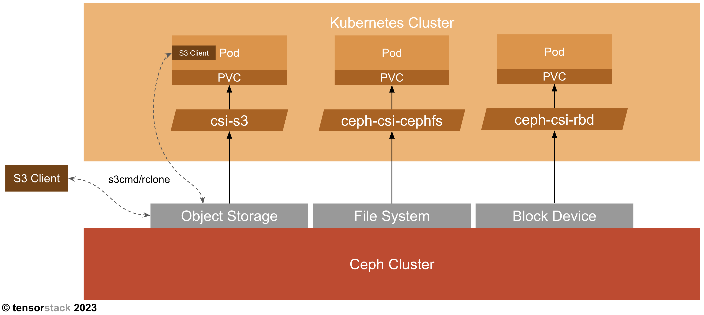

# Ceph 管理员手册

Ceph 是一个高可靠性、可扩展的分布式存储服务，能够存储 PB 级别的海量数据，并对外提供文件系统、对象存储、块存储接口，其架构见[官方文档](https://docs.ceph.com/en/latest/architecture/)。

TensorStack AI 平台支持使用 Ceph 作为集群存储服务，并提供 PVC、S3 等方式使用。下图展示了 K8s 集群与 Ceph 集群如何协同工作：

<figure class="architecture">
    
<figcaption align="center">图 1：Ceph 提供 Object Storage、File System、Block Device 三种接口。1）对于 Object Storage 接口，用户可以从 K8s 集群内或 K8s 集群外通过任意 S3 客户端（例如 s3cmd、rclone）直接连接，或者通过 CSI 机制将 S3 bucket 挂载为 PVC；2）对于 File System 接口，用户可以通过 CSI 机制将 File System 作为 PVC 的底层存储来源；3）对于 Block Device 接口，用户也可以通过 CSI 机制将其作为 PVC 的底层存储来源。</figcaption>
</figure>

本手册在 [Ceph 官方文档](https://docs.ceph.com/en/quincy/)的基础上提供更加具有针对性的指导，方便管理员对 TensorStack AI 平台中部署的 Ceph 存储集群进行日常管理、故障排查等工作。
